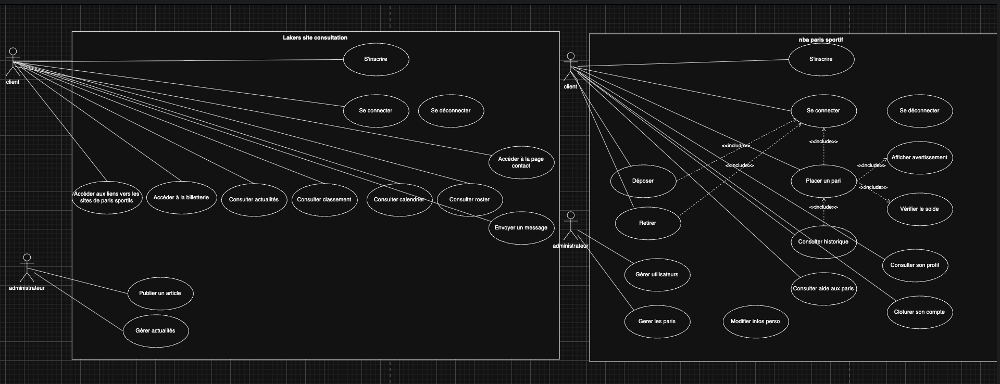

# DOCUMENT DE SPÉCIFICATIONS FONCTIONNELLES

Nom du projet : Lakers Newz (Symfony-LakersNewz)

Client / Organisation : M2I Formation

Auteur(s) : Dybril Boudiaf - étudiant dev

Version : v1.0.0

Date : 16/07/2026

Statut :

- [x] Brouillon
- [ ] En validation
- [ ] Validé

## HISTORIQUE DES VERSIONS

| Version | Date       | Auteur         | Description         |
|--------:|------------|----------------|---------------------|
|  v1.0.0 | 16/07/2026 | Dybril Boudiaf | Création du contenu |

## 1. CONTEXT DU PROJET

### 1.1 Présentation générale

> Ce document décrit les spécifications fonctionnelles de Lakers Newz, une application web d'actualités
> et de paris sportifs virtuels autour des Los Angeles Lakers (NBA).

Réalisée dans le cadre du titre professionnel Développeur Web et Web Mobile (DWWM), l'application propose
deux modules : un module d'actualités (articles, classement NBA, calendrier, effectif) et un module de
paris en monnaie virtuelle (paris simples et combinés, gestion d'un solde, historique).

### 1.2 Objectifs du projet

#### Objectifs spécifiques du projet :

- Centraliser l'actualité des Los Angeles Lakers (articles, classement, calendrier, effectif).
- Permettre à un membre inscrit de placer des paris en monnaie fictive et de suivre son historique.
- Offrir un espace d'administration pour gérer les articles, les matchs et les résultats.

## 2. PÉRIMÈTRE

### 2.1 Inclus dans le projet

#### Fonctionnalités incluses :

- Consultation des articles, du classement NBA, du calendrier et de l'effectif.
- Création de compte, connexion et gestion de profil.
- Dépôt et retrait de monnaie virtuelle.
- Placement de paris simples et combinés, avec historique et résolution automatique.
- Recherche d'articles.
- Administration : gestion des articles (CRUD), des matchs et saisie des résultats.

### 2.2 Exclus du projet

#### Non inclus :

- Paris avec de l'argent réel (la monnaie est exclusivement virtuelle).
- Application mobile native.
- Messagerie entre utilisateurs.

#### Évolution future :

- Passage en HTTPS (nom de domaine + certificat Let's Encrypt).
- Relier les paris simples à leur match précis (comme les combinés).
- Enrichissement des types de paris proposés.
- Tests fonctionnels automatisés.

## 3. ACTEUR

| Acteur         | Description                                   | Droits         |
|----------------|-----------------------------------------------|----------------|
| Visiteur       | Visiteur non connecté du site                 | Accès limité   |
| Membre         | Utilisateur inscrit et connecté               | Accès basique  |
| Administrateur | Gestionnaire des articles, matchs et paris    | Accès complet  |

## 4. DESCRIPTION FONCTIONNELLE DÉTAILLÉE

### 4.1 Cas d'utilisation



#### UC-01 - Inscription utilisateur

```
Acteur : Visiteur

Donnée d'entrée :
Le cas commence lorsqu'il clique sur le bouton s'inscrire.

Scénario principal :
    1. Le système demande de saisir email, pseudo, nom, prénom et mot de passe.
    2. Le visiteur saisit ses informations puis valide.
    3. Le système crée le compte et informe que l'inscription est réussie.

Scénario d'erreur : Email déjà existant
    3a. Le système informe que l'email est déjà utilisé.
    Retour à l'étape 1.

Scénario d'erreur : Champs requis
    3a. Le système informe que certains champs sont requis.
    Retour à l'étape 1.
```

#### UC-02 - Authentification utilisateur

```
Acteur : Membre

Donnée d'entrée :
Le cas commence lorsqu'il clique sur le bouton se connecter.

Scénario principal :
    1. Le système demande de saisir email et mot de passe.
    2. Le membre saisit ses identifiants puis valide.
    3. Le système vérifie les identifiants et ouvre la session.
    4. Le membre est connecté.

Scénario d'erreur : Identifiants invalides
    3a. Le système informe que les identifiants sont invalides.
    Retour à l'étape 1.
```

#### UC-03 - Placer un pari

```
Acteur : Membre

Donnée d'entrée :
Le cas commence lorsqu'un membre connecté ajoute une ou plusieurs sélections au coupon.

Scénario principal :
    1. Le membre sélectionne une cote sur un ou plusieurs matchs.
    2. Le système ajoute chaque sélection au coupon et met à jour la cote totale.
    3. Le membre saisit sa mise puis valide le pari.
    4. Le système débite la mise du solde et enregistre le pari (statut en cours).

Scénario d'erreur : Solde insuffisant
    4a. Le système informe que le solde est insuffisant.
    Retour à l'étape 3.
```

#### UC-04 - Déposer de la monnaie virtuelle

```
Acteur : Membre

Donnée d'entrée :
Le cas commence lorsqu'un membre connecté choisit de déposer de la monnaie.

Scénario principal :
    1. Le membre choisit un montant.
    2. Le système ouvre le tunnel de paiement Stripe (mode test).
    3. Le paiement test est validé.
    4. Le système crédite le solde et enregistre la transaction.
```

#### UC-05 - Saisir le résultat d'un match (administration)

```
Acteur : Administrateur

Donnée d'entrée :
Le cas commence lorsque l'administrateur saisit le résultat d'un match.

Scénario principal :
    1. L'administrateur saisit les scores et l'équipe gagnante.
    2. Le système compare l'équipe gagnante aux sélections des paris concernés.
    3. Le système résout les paris : gagné (gains crédités) ou perdu.
    4. Pour un combiné, toutes les sélections doivent être gagnantes.
```

## 5. RÈGLES DE GESTION

- **RG-001** : Une adresse email ne peut être utilisée que pour un seul compte.
- **RG-002** : Les mots de passe sont hachés et ne sont jamais stockés en clair.
- **RG-003** : La mise est débitée du solde dès la validation du pari.
- **RG-004** : Le gain d'un pari gagnant est égal à la mise multipliée par la cote (la cote inclut la mise).
- **RG-005** : Un pari combiné est gagnant uniquement si toutes ses sélections sont gagnantes.
- **RG-006** : La monnaie utilisée est fictive ; aucun argent réel n'est engagé.

## 6. EXIGENCES NON FONCTIONNELLES

#### Exigences spécifiques :

- Interface responsive (mobile, tablette, desktop).
- Conformité RGPD (données personnelles) et prise en compte du RGAA (accessibilité).

### 7.1 Performance

- Mise en cache des données du classement et du calendrier (API ESPN) via Redis.

### 7.2 Sécurité

- Authentification par session avec un authenticator personnalisé et protection CSRF.
- Protection contre les failles OWASP (XSS via l'échappement Twig, injection SQL via requêtes préparées Doctrine).

#### Exigences à respecter

- Architecture **MVC** (Symfony).
- Secrets non versionnés (fichier `.env.local` ignoré par Git).

### 7.3 Compatibilité

#### Environnement

- Développement
- Production

### 8. CONTRAINTES

#### Contraintes spécifiques :

- Framework **Symfony** et base de données **MySQL** imposés.
- **CSS et JavaScript vanilla** (sans framework).
- Hébergement sur Amazon Web Services (AWS EC2).

#### Contraintes réglementaires :

- Respect du RGPD.

#### Contraintes deadline :

- Application prête pour la soutenance du titre DWWM.

### 9. LEXIQUE

- **ORM (Object-Relational Mapping)** : technique reliant les objets du code (entités) aux tables de la base de données.

- **Doctrine** : ORM utilisé par Symfony pour manipuler la base de données via des objets PHP.

- **Twig** : moteur de templates de Symfony servant à générer les pages HTML.

- **Fixtures** : jeux de données de test chargés automatiquement dans la base.

- **Cote** : coefficient multiplicateur d'un pari ; le gain est égal à la mise multipliée par la cote.

- **Pari combiné** : pari regroupant plusieurs sélections ; il n'est gagnant que si toutes le sont.

- **Redis** : base de données NoSQL clé-valeur en mémoire, utilisée ici comme cache.
