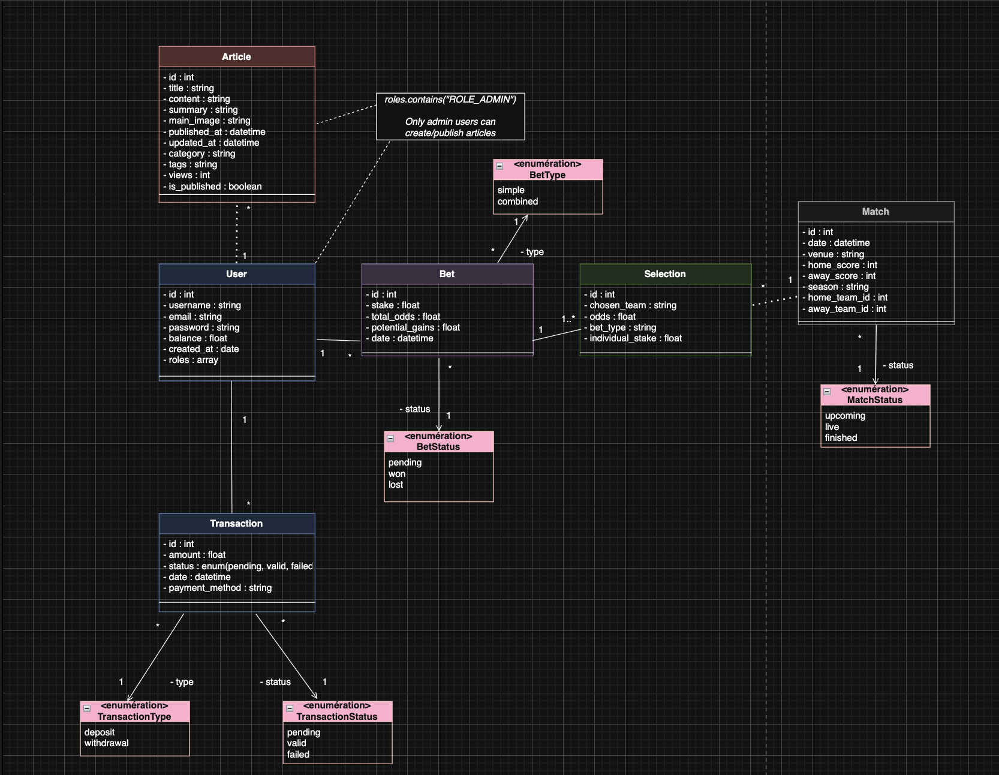

# DOCUMENTATION TECHNIQUE

Nom du projet : Lakers Newz (Symfony-LakersNewz)

Client / Organisation : M2I Formation

Auteur(s) : Dybril Boudiaf - étudiant dev

Version : v1.0.0

Date : 16/07/2026

Statut :

- [x] Brouillon
- [ ] En validation
- [ ] Validé

## HISTORIQUE DES VERSIONS

| Version | Date       | Auteur         | Description              |
|--------:|------------|----------------|--------------------------|
|  v1.0.0 | 16/07/2026 | Dybril Boudiaf | Initialisation du projet |

## 1. INTRODUCTION

### 1.1 Objectif du document

> Ce document décrit l'architecture technique, les composants métier, les technologies utilisées et les choix
> d'implémentation de l'application.

L'objectif spécifique du document est de permettre à une nouvelle équipe technique de maintenir et de faire
évoluer l'application Lakers Newz.

### 1.2 Références

- [Spécifications fonctionnelles v1.0.0][1]
- [README d'installation][2]

[1]: ./functional_documentation.md
[2]: ./README.MD

## 2. ARCHITECTURE GENERALE

### 2.1 Vue d'ensemble

L'application repose sur une architecture **MVC** (Modèle-Vue-Contrôleur) fournie par Symfony :

- **Modèle** : les entités Doctrine et la base de données MySQL.
- **Vue** : les templates Twig.
- **Contrôleur** : les contrôleurs Symfony qui orchestrent la logique et relient le modèle à la vue.

Elle s'appuie également sur un cache **Redis** pour les données externes (API ESPN) et sur **Stripe**
(mode test) pour le dépôt de monnaie virtuelle.

## 3. ENVIRONNEMENT TECHNIQUE

### 3.1 Stack technologique

- Langage
  - `PHP|v8.2+`

- Backend
  - `Symfony|v7.4`
  - `Doctrine ORM`

- Base de données
  - `MySQL`
  - `Redis` (cache)

- Frontend
  - `Twig`
  - `JavaScript vanilla`
  - `CSS vanilla`

- Paiement
  - `Stripe` (mode test)

### 3.2 Environnements

Environnements disponibles :

- Développement
- Production

## 4. ARCHITECTURE APPLICATIVE

### 4.1 Structure du projet

```
Symfony-LakersNewz
  |__ assets/          # JS et CSS (front-end)
  |__ config/          # Configuration Symfony (packages, routes, sécurité)
  |__ migrations/      # Migrations Doctrine
  |__ public/          # Point d'entrée web (index.php)
  |__ src/
  |    |__ Controller/     # Contrôleurs (Article, Pari, Profil, Security, Admin...)
  |    |__ Entity/         # Entités Doctrine (User, Article, MatchNba, Pari...)
  |    |__ Repository/     # Requêtes d'accès aux données
  |    |__ Form/           # Formulaires
  |    |__ Security/       # Authenticator personnalisé
  |    |__ DataFixtures/   # Jeux de données de test
  |__ templates/       # Vues Twig
  |__ tests/           # Tests PHPUnit
```

## 5. BASE DE DONNEES

### 5.1 Diagramme de classes



Le modèle comporte 7 entités : `User`, `Article`, `MatchNba`, `Pari`, `Selection`, `Transaction` et `Contact`.

### 5.2 Contraintes

- Un `User` peut avoir plusieurs `Pari` (relation `OneToMany` / `ManyToOne`).
- Un `Pari` peut contenir plusieurs `Selection` (gestion des paris combinés).
- Chaque `Selection` est reliée à son `MatchNba` précis (`ManyToOne`), ce qui permet une résolution fiable.
- Les migrations Doctrine versionnent la structure ; la base peut être sauvegardée (`mysqldump`) et restaurée.

## 6. SECURITE

### 6.1 Protection des données

- Mots de passe hachés via le composant de hachage de Symfony (algorithme `auto`).
- Authentification par session : authenticator personnalisé, Passport et jeton CSRF.
- Contrôle d'accès par rôle (`access_control` dans `security.yaml` : routes `/admin` réservées à `ROLE_ADMIN`).
- Protection contre l'injection SQL par les requêtes préparées de Doctrine.
- Protection contre le XSS par l'échappement automatique de Twig.
- Secrets (base de données, clés Stripe) conservés dans `.env.local`, ignoré par Git.

## 7. TESTS

### 7.1 Tests unitaires

- Tests unitaires réalisés avec **PHPUnit** (`PariTest.php`) : calcul des gains d'un pari gagnant,
  cas d'un pari perdant, crédit du solde.
- Analyse de la qualité et de la sécurité du code avec **SonarCloud**.
